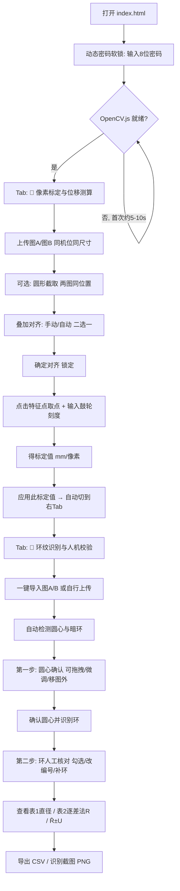

# 🔬 牛顿环实验测量工具 — 完整操作流程与改善建议

> 生成日期：2026-09-13　基于当前 `master` 分支代码梳理（`index.html` / `js/app.js` / `js/image-registrator.js` 等）
> 说明：本文档**只梳理操作流程 + 提供操作体验（UX）改善建议**，不含任何代码改动。
> ⚠️ 旧《交接文档.md》（2026-08-26）已过时：Tab 顺序、圆形截取、叠加对齐、圆心/环人工核对、全屏补环、动态密码锁、逐差法步长默认 5、像素标定值取消默认值等均未反映，本文以现状为准。

---

## 第一部分 · 完整操作流程（端到端）

### 总览

> 逻辑顺序是**先标定（左 Tab）后识别（右 Tab）**：标定产出的 `mm/像素` 喂给识别端才能算出物理直径与曲率半径。若已有可靠标定值，也可跳过左 Tab，在右 Tab 手动输入。

---

### 阶段 0 · 启动与入口

1. **打开方式**
   - 本地：直接双击 `index.html`（`file://` 协议，需 Chrome 80+/Firefox 75+/Edge 80+，支持 ES6 模块）。
   - 线上：GitHub Pages（push 到 `master` 自动部署）。
   - ⚠️ `readme.html`（查看使用文档）在 `file://` 下因 CORS 无法 `fetch('README.md')`，本地看说明需起 HTTP 服务（如 `npx http-server`）；线上不受影响。
2. **OpenCV.js 异步加载**：约 9.7MB，首次加载 5–10 秒；就绪前无法处理图片/对齐/检查（日志面板会提示"OpenCV 已就绪"）。
3. **动态密码软锁**（入口全屏遮罩，纯前端"防君子"）
   - 8 位密码 = **年后两位×2 + 月×2 + 日×2 + 时×2**，每段补零 2 位后拼接。
   - 例：2026-09-13 14 时 → `52` `18` `26` `28` → **52182628**。
   - 容差：**当前小时或前一小时**的密码均有效（跨日/月/年自动处理）；每整点变化。
   - 解锁后写入 `sessionStorage`，本次会话内不再询问；仅限 `index.html`；不显示算法、不限尝试次数。
4. **顶部两个 Tab**（左→右）
   - 📏 **像素标定与位移测算**（`activeTab='calibration'`）
   - 🔬 **环纹识别与人机校验**（`activeTab='rings'`）
   - 当前 Tab 持久化在 `sessionStorage['activeTab']`。

---

### 阶段 1 · 像素标定与位移测算（产出 mm/像素）

**目的**：转动测微鼓轮移动已知物理距离，前后拍同一视野两张图，换算真实"mm/像素"，替代手动估值。

1. **上传图A（移动前）/ 图B（移动后）**
   - 必须**同机位、同尺寸**；尺寸不一致时无法叠加对齐（页面会红字告警）。
   - 支持"全部重置"清空重来。
2. **原图展示 + 读数刻度**
   - 左栏始终显示未经处理的原图A/原图B。
   - 各自下方输入**读数显微镜刻度（mm）**；系统自动算 `|刻度A − 刻度B|` 作为默认物理距离（3 位小数），也可在结果区手动覆盖。
3. **✂️ 圆形截取（可选，推荐用于只对齐中心环区）**
   - 在**图A**上拖拽红色圆圈框选截取范围：
     - 拖**圆内** = 移动圆心；拖**圆周右侧红手柄** = 改半径。
     - 半径四种方式任选：拖手柄 / 拖滑块 / 点 `－` `＋` 按钮 / 键盘 `+` `−`（Shift 加速 ±50px）；聚焦画面后 `方向键` 移圆心、`Home` 复位。
     - 半径范围 **20px ~ 短边一半**；圆靠边时自动把圆心往回推，不会强行压小半径。
   - 点**确认截取**：两图按**完全相同的位置**剪下同一块**方形**区域。
     - 为什么存方形而非圆形抠图：圆形抠图圆外透明，算法读图时透明当纯黑，那条人工圆边在两图位置完全相同，会把对齐**锁死在偏移≈0**而环纹依旧错开。
     - 下方叠加画面按**圆形**显示这块区域（内切圆即框选的圆）。
   - 已截取态可点**重新裁剪 / 恢复原图**（沿用上次圆心半径、无需重传；若已锁定对齐或已取点会先弹确认，重裁会清空且不可撤销）。
   - **可跳过本步**，直接对齐全图。
4. **🎨 图像处理（纯显示 / 视觉辅助，不改像素、不参与配准与取点）**
   - **观察模式**：🌈 彩色叠加 / ⬜ 灰度叠加（去色排除色彩干扰，重影更清楚）。
   - **⭕ 辅助对齐圆环**：添加可拖拽的霓虹同心参考环套住牛顿环，帮助第一轮手动粗对齐。拖任意环线 = 移动共同圆心（整组平移）；拖某环右侧手柄 = 改该环半径；环内空白点击仍是取点（不冲突）。
5. **🔍 叠加对齐**（图A固定底图，图B半透明叠加；两条路径**共享同一偏移**，二选一即可）
   - **模式一 · 手动叠加**：拖 `Δx` `Δy` 滑块或方向键（Shift+方向键 = 5px），参考**重合度残差**把数值调到最小；点**🔍 检查对齐**得到**权威残差 + PSR 置信度 + 方向建议**（基于整图相关，非肉眼）；可开**👁 闪烁对比**（600ms/相位，错位环纹跳动、对齐后跳动消失）辅助判读。
   - **模式二 · 自动叠加**：点**🤖 全局对齐**，无需先手动粗对齐，直接从任意偏移一键求解完整平移量（亚像素；整图相关 + PSR 置信闸门，绝不假阳性）。
   - **公共操作**：`↺ 一键复位`、`👁 闪烁对比`、`🔒 确定对齐`（锁定后偏移不可变，按钮旁出现 🔒，方可取点；再点为 🔓 解锁）。
   - ⚠️ 环纹具**自相似性**，肉眼可能在多个位置都"看似重叠"，请以**检查对齐**的权威残差为准。
6. **取点**：**锁定对齐后**，在叠加画面上点击同一物理特征点，每次点击**新增一组一行**：图A坐标、图B坐标（含确定性亚像素定位分量）、ΔX、ΔY、像素距离、该组标定值。可删除单组 / 清空全部。像素值统一保留 2 位小数。
7. **物理距离**：由图A/图B刻度自动算出并填入，也可手动输入覆盖（刻度变化时自动更新）。
8. **标定值** = 物理距离 ÷ 像素距离（多点取平均），**固定保留 4 位有效数字**。
9. **✅ 应用此标定值到环纹识别与人机校验** → 写入识别端 `pixelScale` 并自动切到右 Tab。
10. **缓存**：标定图片、标记点、刻度、截取标志自动存 `sessionStorage`，刷新不丢（原图过大超配额时降级为不含图片的缓存，至少保住刻度/距离/截取标志）。但**应用到识别端的 `pixelScale` 本身不持久化**（见阶段 2）。

---

### 阶段 2 · 环纹识别与人机校验（主测量）

0. **图片来源**
   - **一键导入图A / 图B**（取自标定板块的原图，自动开始识别），或点"原始图像"框**自行上传**（点击 / 拖拽，支持多选批量，JPG/PNG/WEBP）。
   - 批量上传时**只自动处理最后一张**，其余切换到时才处理；顶部缩略图可切换 / × 删除。
1. **自动检测流程**（上传后自动执行，也可点"重新处理"重跑）
   - 预处理：灰度化 → CLAHE 对比度增强 → 中值滤波去噪；
   - 圆心定位：霍夫圆检测外边界 → 失败退回亮度加权质心 → "圆周亮度标准差最小"局部精修；
   - 暗环检测：多角度径向剖面采样 → 平滑 → 局部最小值 → 非极大值抑制 → 半径聚类 → **r²∝m 线性拟合精修**；
   - 结果按半径升序编号 1..N（**隐含假设最内圈 = 第 1 级暗环**）。
2. **🎯 第一步：圆心确认**（人工兜底，`centerPhase='awaiting-center'`）
   - 拖拽圆心 / 方向键微调（1px，Shift 5px）/ 直接输入 X、Y；
   - `+` `−` 键加长/减短圆心十字光标（8px，Shift 40px，上限达半对角线）；
   - **圆心允许移到图片范围外**（光学中心落在图外时），出界时边缘绘制指向箭头，并动态重算搜索半径；
   - 确认后点 **✅ 确认圆心并识别环**，或 **🔄 重新检测圆心**。
3. **✋ 第二步：环人工核对**（`centerPhase='done'`）
   - 全部环默认勾选；**取消勾选**剔除误检环（重新勾选恢复）；**编号可直接修改**；发现**漏检**暗纹直接在图上点击补入；未勾选的环不参与表1/表2 计算与绘图。
   - 取消勾选后编号策略可选：**保持原编号** / **顺延重排**。
4. **⛶ 全屏放大补环**（可选，精准补漏）
   - 一键自动取景（以圆心为中心、边长 = 2×外边界半径，涵盖全部已识别环）并等比放大到全屏；
   - 滚轮缩放 / `+` `−` 缩放、左键拖拽 / 方向键平移（Shift 加速）、**左键点击在该半径补一个环**；
   - 底部读数栏实时显示原图坐标与半径 r（补环只取决于半径，切向点偏不影响结果）；彩色/灰度观看模式与主视图同步；`⤢ 复位全览`、`✖ 关闭 (ESC)`。
5. **图像预处理参数调试**（8 个滑杆）：亮度、对比度、模糊、灰度、锐化、边缘增强、CLAHE Clip、CLAHE Tile。调整时有**实时 CSS 滤镜预览**，点"重新处理"后才走 OpenCV 真实管线（其中 CLAHE 参数会真正参与检测，其余对实际检测作用有限，调参后务必看检测结果而非预览）。
6. **像素标定值输入**：手动输入 `mm/像素`，或用阶段 1 应用来的值。
   - **无默认值**（初始空白）；**不持久化**，刷新后需重新应用或手动输入。
   - **未设定（空 / ≤0）时统一降级**：表1"直径(mm)"列显示 `—`、表2 全组 `—`、不确定度告警、**导出 CSV 被拦截**并提示先设定标定值。
7. **结果展示**
   - **表1**：各暗环直径（像素 2 位小数 + mm 3 位小数）；勾选 / 编号与图像双向联动高亮。
   - **表2**：逐差法曲率半径。**步长 (m−n) 默认 5**，可人工修改（会话内保留，刷新回默认）；分组为 D_m 与 D_{m−步长}。`D_m²−D_n²` 按误差传播定小数位、`R` 每组有效数字由本组差值决定（四舍六入五成双）。
   - **平均曲率半径**：`R̄ ± U`（扩展不确定度，p=0.683、k=1），可展开查看五步评定明细（A类 / B类 / 合成 / 扩展）。
8. **数据导出**
   - **导出 CSV**：含 BOM（Excel 不乱码），直径表 + 曲率半径表 + 元信息；未设定标定值时拦截。
   - **导出识别截图**：底图 + Canvas 标注层合并为 PNG。
9. **日志面板**：实时显示处理进度（[10%]…[100%]）与状态提示，最多保留 20 条。

---

### 关键前置依赖与易错分支

| 条件 | 表现 / 后果 |
|---|---|
| OpenCV 未就绪 | 无法处理图片、对齐、检查对齐（相关按钮禁用） |
| 图A/图B 尺寸不一致 | 无法叠加对齐（红字告警，需同机位拍摄） |
| 未设定像素标定值 | 表1 mm 列 `—`、表2 全 `—`、CSV 导出被拦截 |
| 批量上传多图 | 只自动处理最后一张，其余切换时才处理 |
| 拖拽上传 | **仅**在"环纹识别"Tab 生效 |
| `pixelScale` 不持久化 | 刷新页面后回空白，需从标定 Tab 重新应用或手动输入 |
| 方向键全局监听 | 只要标定标记点存在，**任何 Tab** 下按方向键都会移动它，并拦截数字框原生方向键行为 |
| sessionStorage 约 5MB | 图片 base64 全文存储，多张大图会**静默保存失败**（仅 console.warn），表现为刷新后缓存丢失 |

---

## 第二部分 · 操作体验 / UX 改善建议

> 本节**仅从操作体验（UX）角度**给建议（不含算法精度、工程质量、部署安全的深入修法）。每条含：**现状痛点 → 建议 → 影响面**，并按 **高 / 中 / 低** 优先级排序。个别条目的根因其实在工程/部署，但会**从"用户实际感知"的体验角度**提出，已标注。

### 🔴 高优先级

**1. Tab 命名与序号在多处不一致，易误导**
- 现状：实际按钮顺序是「左 = 📏 像素标定与位移测算、右 = 🔬 环纹识别与人机校验」；但像素标定输入框提示写"请先在 **tab1「像素标定」**标定"，代码注释又把环纹识别叫"**Tab 2**"，旧交接文档更是把两者顺序写反。名称也在"像素标定 / 像素标定与位移测算""牛顿环识别 / 环纹识别与人机校验"间摇摆。
- 建议：统一一套**面向用户的称谓与序号**（如"第 1 步 标定 / 第 2 步 识别"），Tab 按钮、提示文案、导入按钮、应用按钮全部对齐；避免"tab1/tab2"这类与视觉顺序冲突的内部叫法出现在界面文案里。
- 影响面：纯文案，改动小、风险低，但直接降低新手困惑。

**2. 缺少首次进入的流程引导 / 步骤感**
- 现状：进来先看到的是标定 Tab（左），但界面上没有"先标定→再识别→后导出"的主线提示，新用户不知道从哪开始、两 Tab 的依赖关系。
- 建议：在顶部加一条**轻量步骤条或一句话流程指引**（1 标定 mm/像素 → 2 识别与核对 → 3 查看/导出），并在右 Tab 未设定标定值时给"去标定"的显眼入口。
- 影响面：小；显著提升上手速度。

**3. OpenCV 加载态不够醒目**
- 现状：首次加载 9.7MB 引擎需 5–10s，期间相关按钮禁用，但缺少一个明确的"引擎加载中"的全局反馈，用户容易以为卡住或点了没反应。
- 建议：加一个**全局加载遮罩 / 进度提示**（"正在加载图像引擎…"），就绪后自动消失。
- 影响面：小；改善首屏等待体验。

**4. "最内圈 = 第 1 级暗环"这一编号起点缺少显式确认**
- 现状：第二步可改编号，但"编号起点假设"没有专门提示；若中心被遮挡或漏检导致整体偏移，用户不易察觉，会引入系统性误差。
- 建议（UX 角度，不深入算法）：在第二步核对面板加一句**起始环级确认提示**，或提供"设定最内环为第几级"的输入，让用户主动确认起点。
- 影响面：中；把隐性假设变成显式操作，降低误用。

### 🟡 中优先级

**5. 标定 Tab 概念密度高，新手易迷失**
- 现状：一个 Tab 内并存"圆形截取 / 观察模式 / 辅助对齐圆环 / 手动对齐 / 自动对齐 / 检查对齐 / 闪烁对比 / 锁定 / 取点"众多概念，虽然都有说明文字，但信息量大。
- 建议：给出**推荐主路径高亮**（如"上传 → 全局对齐 → 确定对齐 → 取点"），把截取、辅助环、闪烁对比等**高级/可选项折叠**，默认展开最小必要集。
- 影响面：中；不改功能，只调信息层级。

**6. 方向键全局劫持造成误操作**（根因偏工程，从体验角度提）
- 现状：只要标定标记点存在，任何 Tab 按方向键都会移动它，并 `preventDefault` 拦截数字输入框的原生方向键行为，容易在别处误触。
- 建议：把方向键作用域**限定到对应画面聚焦时**（如截取/叠加舞台获得焦点才响应），避免全局劫持。
- 影响面：中；减少意外移动与输入干扰。

**7. 未设定标定值时结果区"空得没解释"**
- 现状：未设定时表1 mm 列 `—`、表2 全 `—`、导出被拦截，但用户未必明白"为什么是空的"。
- 建议：在结果区顶部给一条**醒目引导**（"尚未设定像素标定值 → 去标定 / 手动输入"），把分散的 `—` 与拦截提示串成一个明确原因。
- 影响面：小；降低困惑。

**8. 缓存静默失败用户无感**（根因偏工程，从体验角度提）
- 现状：图片以 base64 全文存 sessionStorage，超约 5MB 会静默保存失败（仅 console.warn），表现为"刷新后数据莫名丢失"。
- 建议：保存失败时给**用户可见的一次性提示**（如"图片过大，刷新后可能不保留，建议压缩或减少数量"）。
- 影响面：小；把隐性失败变成可预期行为。

### 🟢 低优先级

**9. 瞬时提示 / 日志易错过**
- 现状：日志面板最多 20 条，很多提示是瞬时的，关键错误可能被刷掉。
- 建议：关键错误/结果**留存更久或可复制**，与一般进度提示区分视觉权重。

**10. 快捷键缺少集中说明**
- 现状：全屏补环、截取、对齐、圆心调整等各有快捷键（方向键、+/−、Home、Shift 加速等），说明分散在各处提示里。
- 建议：加一个**"键盘快捷键"帮助浮层**集中列出，按需查看。

**11. `readme.html` 本地打不开**（根因偏部署，从体验角度提）
- 现状：双击本地打开时点"📖 查看使用文档"，因 `file://` 下 CORS 无法加载 README.md，页面空白。
- 建议：本地场景给一句提示（"文档需在线或本地服务查看"）或将说明内容内联，避免用户以为坏了。

---

## 附：与旧《交接文档.md》的主要差异（供维护时同步）

- Tab 顺序与命名：**左 标定 / 右 识别**（旧文档写反）。
- 新增：入口**动态密码软锁**、**圆形截取**、**叠加对齐（手动/自动/检查/闪烁/锁定）**、**辅助对齐圆环**、**圆心确认（可移图外）**、**环人工核对（勾选/改编号/补环）**、**全屏放大补环**、**一键导入图A/图B**。
- 变更：逐差法步长默认 **3 → 5**；像素标定值**取消默认 0.005 → 空白未设定**（未设定统一降级 + CSV 拦截）。

*以上差异建议下次维护时同步回《交接文档.md》，避免两份文档长期打架。*
